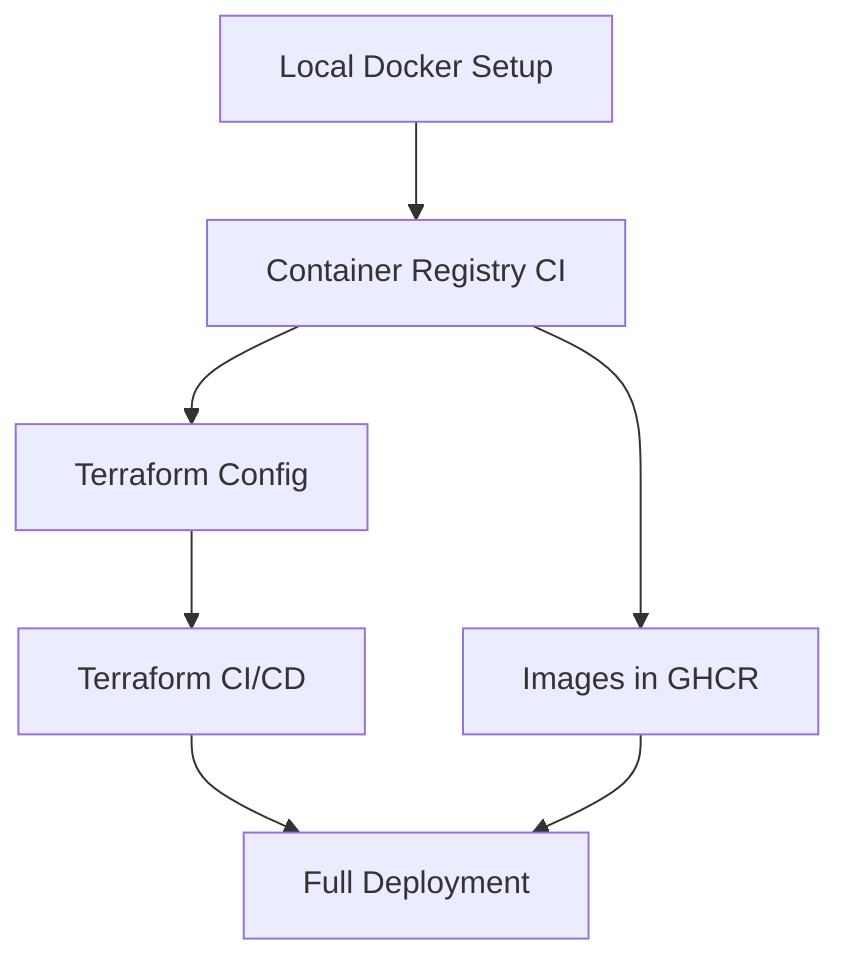

Great question! The order matters a lot for a smooth implementation. Here's the logical sequence:

## Phase 1: Foundation & Local Development (First)
**Goal**: Get the basic Docker setup working locally before automating anything

1. **Create the root `docker-compose.yml`** (as outlined in `dockerization.md`)
2. **Create Dockerfiles** for each service (cms, frontend, workers)
3. **Test locally** with `docker compose up` to ensure everything works
4. **Create `.env.example`** with all required variables documented

*Why first?* You need working containers before you can push them anywhere or deploy them.

## Phase 2: Container Registry & CI (Second)
**Goal**: Automate image building and publishing

5. **Set up GitHub repository** with proper structure
6. **Create GitHub Actions workflow** for building images (`.github/workflows/build-images.yml`)
7. **Configure GitHub secrets** for container registry access
8. **Test the build pipeline** - push some code changes and verify images appear in GHCR
9. **Update `docker-compose.yml`** to use registry images instead of local builds

*Why second?* Terraform will need to pull these pre-built images, so they must exist first.

## Phase 3: Infrastructure as Code (Third)
**Goal**: Create repeatable infrastructure deployment

10. **Set up DigitalOcean Spaces** for Terraform state (manual step)
11. **Create Terraform configuration** (`develop/deploy/public-dev/infra/`)
    - `main.tf`, `variables.tf`, `outputs.tf`, `backend.tf`
    - `provision.sh.tpl` template
    - `terraform.tfvars.example`
12. **Test Terraform locally** first:
    ```bash
    terraform init
    terraform plan
    # Don't apply yet!
    ```

## Phase 4: Terraform Automation (Fourth)
**Goal**: Automate infrastructure deployment

13. **Create Terraform GitHub Actions workflow** (`.github/workflows/terraform.yml`)
14. **Set up DigitalOcean secrets** in GitHub
15. **Test with a branch/PR** - create a feature branch, modify Terraform, open PR
16. **Verify the plan output** in the PR comment

## Phase 5: End-to-End Deployment (Fifth)
**Goal**: Deploy the complete system

17. **Merge Terraform PR** to trigger actual deployment
18. **Monitor deployment** - check GitHub Actions logs, SSH into droplet
19. **Verify services** are running and accessible
20. **Test the update workflow** - make a code change, verify it deploys

## Critical Dependencies



## Why This Order?

**Bottom-up approach**: Each phase builds on the previous one:
- **Phase 1** ensures your application actually works
- **Phase 2** creates the artifacts (images) that Terraform will deploy  
- **Phase 3** defines the infrastructure but doesn't deploy yet
- **Phase 4** automates the infrastructure deployment safely
- **Phase 5** brings it all together

## Common Mistake to Avoid

❌ **Don't start with Terraform first** - you'll end up trying to deploy non-existent images or debugging infrastructure issues when the real problem is in your application code.

✅ **Start with local Docker** - get your services talking to each other locally, then scale up the automation.

## Quick Validation Points

After each phase, you should be able to:
- **Phase 1**: `docker compose up` works locally
- **Phase 2**: Images appear in `ghcr.io/your-org/asset-archive-*`
- **Phase 3**: `terraform plan` shows reasonable resources
- **Phase 4**: PR comments show Terraform plans
- **Phase 5**: Live application accessible via droplet IP

Would you like me to help you start with Phase 1 - creating the root `docker-compose.yml` and Dockerfiles?